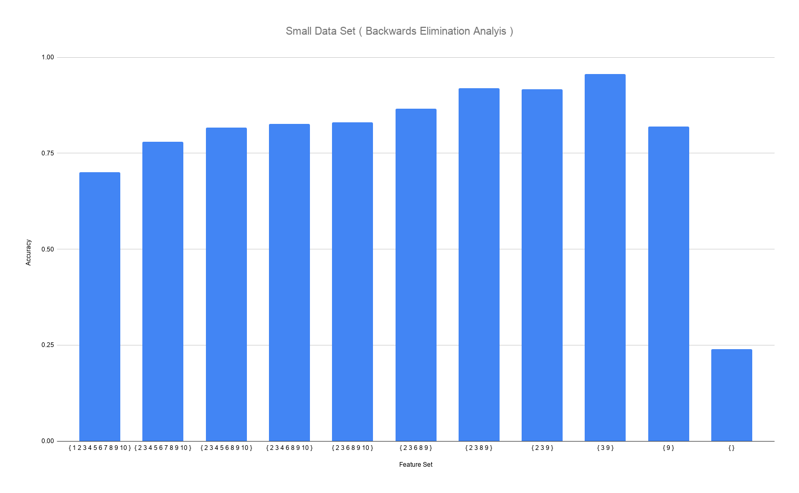

# Nearest Neighbor

## Introduction

Artificial intelligence allows for the efficient analysis of large amounts of data utilizing

algorithms which allow for the consolidation of only important information. One of the most

common algorithms that is utilized for this type of data analysis is the Nearest Neighbor

algorithm. In this project, the nearest neighbor algorithm was utilized to effectively select a

set of data features to maximize the ability to categorize subsequent subjects.

This was done by employing two types of greedy search algorithms. One was a forward

select search, in which the list of features started with the empty set and the feature that

would result in the best accuracy would be added to the list. The other was a backward

elimination search where the list of used data started with every feature and features would

be removed upon determining which elimination would result in the highest accuracy.

These algorithms were tested on both a small data set consisting of 300 subjects with a

list of 10 features each and a large data set with 500 subjects each with 100 features.

## Small Data Set Results and Analysis

For the small data set, the forward selection method was employed first. As can be seen in

Figure 1, the first set that is analyzed is the empty set. To clarify, the empty set when

checked for accuracy will simply return the default rate. Next, the loop will be executed

that finds the feature that, if added, will result in the highest accuracy. Again referring to

the graph in Figure 1, it can be seen that the first feature added was feature 9.

\
Figure 1. Graph depicting the feature set utilized and the resulting percent accuracy for the small data set utilizing the forward search algorithm.

As the next feature is added, feature 3, the accuracy increases; however, after this point the

more features added to the list, the less accurate the categorization becomes.

To continue, the same small data set was analyzed using the backward elimination method.

This method starts the added feature list with all the possible features and removes one per

iteration. In Figure 2 it can be seen that there is an upward trend for the first 9 iterations.

\
Figure 2. Graph depicting the feature set utilized and the resulting percent accuracy for the small data set utilizing the backward elimination algorithm.

However, once the 3 is removed from the feature list, the accuracy drops dramatically. It

ends with the default rate with the empty set. Again it seems that the feature set resulting

in the highest accuracy, .957, is {9, 3}.

## Large Data Set Results and Analysis

The large data set includes 500 separate subjects with a total of 100 collected features each.

The Forward Selection method was utilized to find the best possible combination of features

to categorize unknown subjects. As Figure 3 depicts, the added features increase the

accuracy until abut the fourth added feature after which the accuracy starts on a downward

trend.

\
Figure 3. Graph depicting the feature set utilized and the resulting percent accuracy for the large data set utilizing the forward search algorithm.

The graph omits most of the data gathered but the final two bars indicate the accuracy when

the final two features are added. This shows that the maximum accuracy was about .938.

## Conclusion

This data reveals that the best set of features to accurately categorize future unknown

subjects of the small set would be {9, 3} as can be seen in both the forward selection and

backward elimination method.

Furthermore, the best set for the larger data set is {45, 34, 1, 59} as was shown by the

forward selection method. The backward elimination search of the larger set resulted in a

lower accuracy thus the set can be omitted.

The resulting of each of these percentages are depicted in Figure 4.

\
Figure 4. Table of the maximum accuracy given the method and data set utilized.

To reiterate, the set returned when using the Backward Elimination method is not reported

as the percentage was lower than that of the Forward Selection.

The following Figure 5 reports the time each method took on each of the data sets on a

AMD Ryzen 7 3700X 8-Core Processor.

\
Figure 5. Table of the total time taken by each method of analysis on each data set.

This reveals that the Forward Selection took substantially less time for both the large and

small data sets.

## Works Consulted

• Project 2 briefing lecture

• https://www.geeksforgeeks.org/measure-execution-time-function-cpp/ for timing code

## Trace

